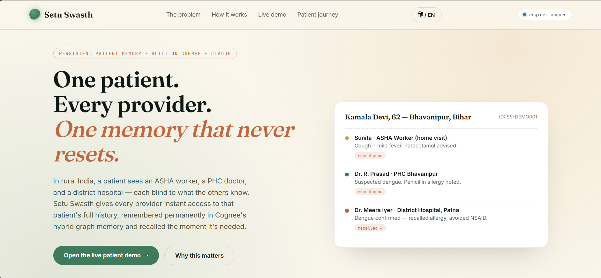
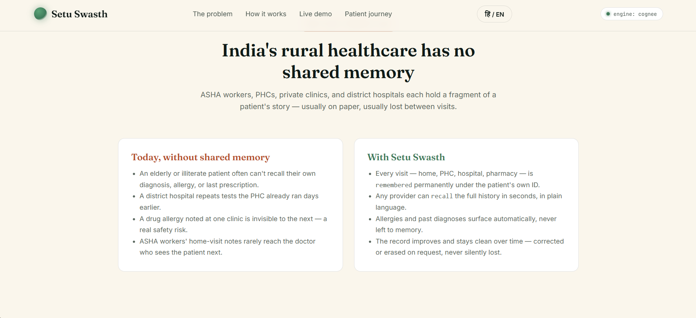
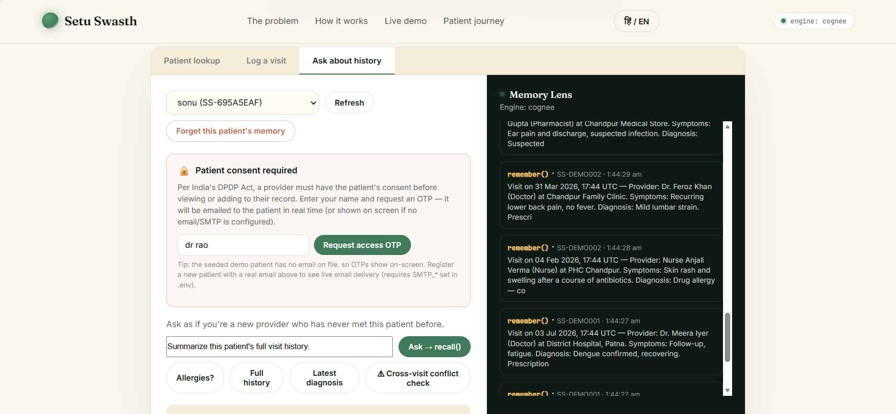
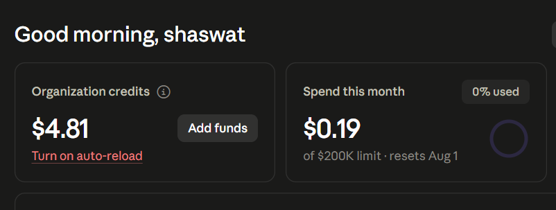

# Setu Swasth (सेतु स्वस्थ)
### Persistent patient memory for India's fragmented rural healthcare — built on Cognee + Claude

> *Setu* (सेतु) — "bridge." *Swasth* (स्वस्थ) — "healthy."
> A bridge between every provider a patient sees — one memory that never resets.

Built for the **Cognee Memory Hackathon**.

---

## Screenshots

**Landing page — the core pitch**


**The problem this solves**


**Live demo — patient lookup, consent/OTP flow, and the "Memory Lens" showing live `remember()` / `recall()` calls**


---

## Proof of Anthropic API credit usage

Real spend against the Anthropic API from this project's Claude integration
(visit summarization, cross-visit conflict synthesis, and the Claude-Code-assisted
development of this repo):



---

## How this maps to the judging criteria

| Criterion | Where to look |
|---|---|
| **Potential Impact** | [The problem](#the-problem-india-specific) — a real, documented gap in India's ASHA → PHC → district-hospital → clinic chain, not a hypothetical use case. |
| **Creativity & Innovation** | The **Memory Graph** panel and its "⚠ Cross-visit conflict check" — Cognee reasons *across* visits logged by different, unconnected providers (e.g. a penicillin allergy noted by a nurse in March, flagged against an amoxicillin prescription filled by an unrelated pharmacy five months later) and the graph visually draws the conflicting edge between them. See [Memory Graph & cross-visit conflict detection](#memory-graph--cross-visit-conflict-detection). |
| **Technical Excellence** | Real (not simulated) OTP delivery with HMAC-hashed storage, constant-time comparison, and rate limiting — see [Consent & access control](#consent--access-control-dpdp-act-alignment). Deploys on Render + Vercel with no Docker required (Docker still supported as an alternative), and degrades gracefully to an in-memory fallback engine with no LLM key. |
| **Best Use of Cognee** | Every patient gets a genuinely isolated Cognee dataset (`patient_<id>`) — `remember`, `recall`, `improve`, and `forget` all consistently scope to it, so one patient's history can never leak into another's, and `forget()` actually erases real data. See [Cognee integration](#cognee-integration-kept-explicit-end-to-end) below. |
| **User Experience** | The "Patient consent required" lock walks a judge through the DPDP-style OTP flow in seconds; the "Memory Lens" panel shows every Cognee call live, the Memory Graph makes the memory layer visible, and a हिं/EN toggle translates the patient-facing surface (hero, problem framing, consent/OTP flow). |
| **Presentation Quality** | This README documents the problem, architecture, security model, and API end to end — see the table of contents below for a full walkthrough. |

---

## The problem (India-specific)

A patient in rural India routinely moves through several *disconnected*
layers of care:

1. An **ASHA worker** does a home visit and notes symptoms — usually on paper, if at all.
2. A **PHC (Primary Health Centre) doctor** sees the patient days later with no record of that visit.
3. A **district hospital** admits the patient with no visibility into the PHC's diagnosis, tests already run, or medicines already tried.
4. A **pharmacy or private clinic** repeats the cycle.

Nobody in this chain sees the full picture. Elderly or illiterate patients
often cannot accurately recount their own medical history. A drug allergy
noted at one clinic is invisible to the next, which is a **real patient
safety risk**, not a hypothetical one.

## The solution

Setu Swasth gives every patient a single, permanent, patient-owned memory
record — built directly on **Cognee's hybrid graph + vector memory engine** —
that any authorized provider can write to and read from, regardless of which
facility they work at.

- Every visit is **remembered** permanently under the patient's own ID.
- Any provider can **recall** the full history in plain language in seconds.
- Allergies and past diagnoses surface automatically — never left to a
  patient's memory or a lost paper slip.
- The record can be **improved** (memify) as it grows, and **forgotten**
  (corrected/erased) on request — memory here is a deliberate choice, not an
  uncontrolled data leak.
- Access requires the **patient's consent**, verified via an OTP flow, before
  any provider can view or add to the record — modeled on India's DPDP Act.

This maps 1:1 onto Cognee's own memory lifecycle:

```python
await cognee.remember(text, dataset_name=f"patient_{pid}", session_id=pid)   # log a visit
await cognee.recall(query, datasets=[f"patient_{pid}"], session_id=pid)      # ask about history
await cognee.improve(dataset=f"patient_{pid}")                               # a.k.a. memify
await cognee.forget(dataset=f"patient_{pid}")                                # correct / erase
```

**This is visible on the frontend, live** — the demo's "Memory Lens" panel
streams every one of these Cognee calls as they happen, so it's never a
black box: you can literally watch `remember()` fire when a visit is logged
and `recall()` fire when a provider asks a question.

## Architecture

```
mnemos/
├── backend/
│   ├── main.py            # FastAPI: patients, visits, consent/OTP, ask/recall, memory log
│   └── requirements.txt
├── frontend/
│   └── index.html         # single-file animated UI: consent flow, patient lookup, visit form, live Memory Lens
├── Dockerfile
├── docker-compose.yml
├── Procfile                # for Render/Railway/Heroku-style deploys
├── render.yaml              # one-click Render blueprint
├── .env.example
└── README.md
```

### Cognee integration (kept explicit, end to end)

- Each **patient** = one genuinely isolated Cognee dataset (`patient_<id>`,
  keyed by their patient ID — e.g. an Ayushman Bharat Health ID or an
  auto-generated `SS-XXXXXXXX`), with `session_id` also set to the patient
  ID for fast session-cache reads. Every one of the four calls below passes
  the dataset consistently — not just a session tag — so one patient's
  history can never bridge into another's permanent graph, and `forget()`
  targets data that was actually written.
- `POST /api/patient/{id}/visit` → `cognee.remember(text, dataset_name=..., session_id=id)`
- `POST /api/patient/{id}/ask` → `cognee.recall(query, datasets=[...], session_id=id)` → grounded Claude summary
  — the demo's "⚠ Cross-visit conflict check" button uses this to ask Cognee
  to reason across every visit logged by *different, unconnected providers*
  (e.g. catching a prescription that conflicts with an allergy noted at a
  different facility weeks earlier) — the kind of cross-record inference a
  flat keyword search can't do without hand-written rules.
- `POST /api/patient/{id}/improve` → `cognee.improve(dataset=...)`
- `POST /api/patient/{id}/forget` → `cognee.forget(dataset=...)`
- `GET /api/memory-log` → live feed of every Cognee call made, powering the
  frontend's Memory Lens panel

If no `LLM_API_KEY` is configured, the backend transparently swaps in a
lightweight in-memory engine with the **exact same interface**, so the whole
product — patient registration, visit logging, recall, the live memory feed —
is instantly demoable with zero setup, and upgrades itself automatically the
moment a real key is added. This is a demo-reliability choice, not a
shortcut around Cognee: the real integration is complete and unmodified from
Cognee's documented API.

### Claude integration

Claude (`claude-sonnet-4-6`, via the Anthropic Messages API) is used **only**
to turn what Cognee recalls into a clear, clinician-usable answer. It is
explicitly instructed to never invent a symptom, diagnosis, allergy, or
medicine that isn't present in the recalled memory — and to say so plainly
if the records don't answer the question.

### Built with Cognee's Claude Code integration

This project was developed using Cognee's official Claude Code integration
(persistent project memory for Claude Code itself while building the repo):
https://github.com/topoteretes/cognee-integrations/tree/main/integrations/claude-code

### Memory Graph & cross-visit conflict detection

`GET /api/patient/{id}/graph` derives an entity/relationship graph from a
patient's visits — patient, providers, facilities, diagnoses,
prescriptions, and allergies as nodes, connected by the visits that mention
them. Recurring entities (the same allergy or provider mentioned across
different visits) collapse into a single shared node — that shared node is
*why* cross-visit reasoning is possible at all: two otherwise-disconnected
visits both touch it, so a provider on visit 3 can be warned about
something only ever noted on visit 1.

This view is rendered as SVG directly in the frontend's "Memory Graph"
panel (no charting library — hand-laid-out, dependency-free) from the same
visit records that feed Cognee's `remember()`/`recall()` calls. It's built
app-side from that data rather than dumping Cognee's internal graph store,
which keeps it fast and fully testable independent of any live LLM key.

The second seeded demo patient (**Ramesh Yadav**) exists specifically to
make this visible: a nurse notes a penicillin allergy in one visit; five
months later, at a different facility with a different provider who never
saw that note, a pharmacist prescribes amoxicillin for an unrelated ear
infection. The graph draws a red, dashed **⚠ CONFLICT** edge directly
between the allergy node and that prescription node — the "⚠ Cross-visit
conflict check" quick-ask button asks Cognee/Claude to explain the same
thing in plain language.

---

## Consent & access control (DPDP Act alignment)

Real patient health data in India must be handled under the **Digital
Personal Data Protection (DPDP) Act, 2023** — informed consent before a
provider accesses a patient's record. This is modeled, not just described:

1. A provider calls `POST /api/patient/{id}/request-access` with their name.
   A cryptographically random 6-digit OTP is generated (via Python's
   `secrets` module) and **emailed to the patient in real time** over SMTP
   if the patient has an email on file and SMTP is configured (see
   [Real-time OTP delivery](#real-time-otp-delivery-free) below). If not,
   the app automatically falls back to on-screen "demo OTP" mode — clearly
   labeled — so it still runs end-to-end without any external account.
2. The provider calls `POST /api/patient/{id}/verify-access` with that OTP.
   On success, they receive a **time-limited access token** (20 minutes).
3. Every sensitive endpoint — `visit`, `timeline`, `ask`, `forget` — requires
   a valid `X-Access-Token` header tied to that patient, or it returns
   `403 Forbidden`.
4. Every access request, grant, failed attempt, and erasure is written to
   an auditable trail: `GET /api/patient/{id}/consent-log`.

**Security hardening applied to the OTP flow:**
- OTPs are never stored in plaintext — only an HMAC-SHA256 digest (keyed by
  `OTP_SECRET`), so a memory dump or log leak can't reveal a live code.
- OTP comparison uses `hmac.compare_digest` (constant-time) to resist
  timing attacks.
- Verification is capped at 5 wrong attempts per OTP before it's invalidated.
- OTP requests are rate-limited to 3 per patient per rolling 10 minutes to
  block spam/abuse.
- OTPs expire after 5 minutes; access tokens expire after 20 minutes.

This is visible end-to-end in the frontend's demo panel: the "Patient
consent required" lock banner walks through requesting and entering the OTP
before any history becomes visible or editable.

**Production note**: a real deployment would also want role-based field
visibility (e.g. an ASHA worker may not need to see full hospital records)
and persistent (not in-memory) storage for OTP/rate-limit state across
restarts — this implementation demonstrates the access-control *pattern*
end to end, now backed by genuine email delivery instead of a simulated one.

### Real-time OTP delivery (free)

No SMS gateway needed — OTPs are delivered over **email**, which is free at
real-world volumes and needs no billing account. Set these in `.env`:

```
SMTP_HOST=smtp.gmail.com
SMTP_PORT=587
SMTP_USER=you@gmail.com
SMTP_PASS=<16-character Gmail App Password>
SMTP_FROM=you@gmail.com
OTP_SECRET=<run: python -c "import secrets; print(secrets.token_hex(32))">
```

**Gmail (easiest, 500 emails/day free):**
1. Turn on 2-Step Verification at `myaccount.google.com/security`.
2. Create an App Password at `myaccount.google.com/apppasswords`.
3. Use that 16-character password as `SMTP_PASS` — not your normal Gmail password.

**Brevo or Resend (better deliverability for a real deployment, still free,
no credit card, ~300 emails/day):** sign up, grab your SMTP credentials, and
set `SMTP_HOST=smtp-relay.brevo.com` (or Resend's SMTP host) with the
provided user/key.

Once configured, register a patient with an email address and every OTP is
delivered live to their inbox — `GET /api/health` will report
`"otp_delivery": "email (live)"` to confirm it's active.

---

## Quickstart (local)

```bash
cd setu-swasth
python3 -m venv .venv && source .venv/bin/activate
pip install -r backend/requirements.txt
cp .env.example .env        # add LLM_API_KEY + SMTP_* (see above)
cd backend
uvicorn main:app --reload --port 8000
```

Open **http://localhost:8000** — the backend serves the frontend directly
from the same origin, so no extra config is needed locally. A demo patient
(Kamala Devi) and a second, deliberately trickier one (Ramesh Yadav — see
[Memory Graph & cross-visit conflict detection](#memory-graph--cross-visit-conflict-detection))
are seeded automatically so the product is explorable immediately.

**Docker, if you prefer it:** `Dockerfile` / `docker-compose.yml` are still
included and unchanged — `cp .env.example .env && docker compose up --build`
works exactly as before. Nothing about the app requires it either way.

## Enabling full Cognee memory + Claude answers

1. Get an Anthropic API key: https://console.anthropic.com/
2. Put it in `.env`:
   ```
   LLM_API_KEY=sk-ant-...
   ```
3. Restart the backend. `/api/health` reports `"engine": "cognee"` once
   active, and the status pill in the UI turns green with the live engine name.

To point at **Cognee Cloud** or a remote instance instead of an embedded
engine, set `COGNEE_BASE_URL` and `COGNEE_API_KEY` — see
[Cognee's docs](https://docs.cognee.ai) for `cognee.serve(...)`.

## API reference

| Method | Path | Body | Description |
|---|---|---|---|
| GET | `/api/health` | — | Reports active memory engine |
| POST | `/api/patients` | `{name, age?, gender?, village?, phone?, email?, patient_id?}` | Register a patient → opens a Cognee dataset (`email` enables real-time OTP delivery) |
| GET | `/api/patients` | — | List all registered patients |
| GET | `/api/patient/{id}` | — | Patient summary + visit count |
| POST | `/api/patient/{id}/request-access` | `{provider_name, provider_type?}` | Send consent OTP to patient's email in real time (falls back to on-screen demo OTP if no email/SMTP configured) |
| POST | `/api/patient/{id}/verify-access` | `{otp, provider_name}` | Verify OTP → issue a 20-min `access_token` |
| GET | `/api/patient/{id}/consent-log` | — | Audit trail of access requests/grants/erasures |
| POST | `/api/patient/{id}/visit` *(requires `X-Access-Token`)* | `{provider_name, provider_type, facility?, symptoms?, diagnosis?, prescription?, allergies_noted?, notes?}` | Log a visit → `cognee.remember()` |
| GET | `/api/patient/{id}/timeline` *(requires `X-Access-Token`)* | — | Chronological visit list (for the UI timeline) |
| GET | `/api/patient/{id}/graph` *(requires `X-Access-Token`)* | — | Entity/relationship graph derived from visits, with cross-visit conflicts flagged (for the Memory Graph panel) |
| POST | `/api/patient/{id}/ask` *(requires `X-Access-Token`)* | `{question, asked_by?}` | Ask about history → `cognee.recall()` → Claude synthesis |
| POST | `/api/patient/{id}/improve` | — | Trigger `cognee.improve()` (memify) |
| POST | `/api/patient/{id}/forget` *(requires `X-Access-Token`)* | `{reason?}` | Erase this patient's memory → `cognee.forget()` |
| GET | `/api/memory-log?limit=` | — | Live feed of recent Cognee calls (Memory Lens) |

## Deployment

Production deploy is a **split**: the FastAPI backend on **Render**, the
static frontend on **Vercel**, talking over CORS (already enabled for all
origins in `main.py`).

**1. Backend → Render** (blueprint included, no Docker required):
```bash
# push this repo to GitHub, then in Render:
# New -> Blueprint -> select this repo -> it reads render.yaml automatically
# (env: python, builds from backend/requirements.txt — no Dockerfile involved)
# set these in the Render dashboard's environment variables:
#   LLM_API_KEY   (required for Cognee + Claude synthesis)
#   SMTP_HOST, SMTP_USER, SMTP_PASS, SMTP_FROM, OTP_SECRET   (for real email OTP)
```
Note the resulting URL, e.g. `https://setu-swasth-api.onrender.com`.

**2. Frontend → Vercel:**
```bash
# in the Vercel dashboard: New Project -> import this repo
# vercel.json (included) points the build at the frontend/ folder directly —
# no build step needed, it's a static single-file app.
```
Then edit `frontend/config.js` (or set it via a Vercel environment
substitution if you prefer) to point at your Render backend:
```js
window.ANAMNIS_API_BASE = "https://setu-swasth-api.onrender.com";
```
Redeploy on Vercel and the frontend will call the Render backend directly.
(Running the backend locally or via Docker instead? Leave `config.js` as-is
— `/config.js` is served dynamically by the backend itself in that mode and
always forces same-origin auto-detection, so nothing needs to be edited.)

**Alternative — single-origin deploy (no Vercel):** Render can serve both
the API and the static frontend from one service, since `main.py` already
mounts `frontend/` and serves `index.html` at `/`. Just don't set
`ANAMNIS_API_BASE` and it auto-detects `location.origin`. This is simpler
but doesn't get Vercel's CDN/edge caching for the static assets.

**Docker (optional, still supported):** `Dockerfile` / `docker-compose.yml`
remain in the repo for a single-container VPS deploy if you'd rather not
split frontend/backend — `docker compose up -d --build`.

**Cognee Cloud:** for managed memory infrastructure instead of running Cognee
embedded, set `COGNEE_BASE_URL` + `COGNEE_API_KEY` (not required — see
[Do I need Cognee Cloud credentials?](#do-i-need-cognee-cloud-credentials)).

## AI-assistance disclosure

Significant portions of this codebase — including the Cognee integration,
the OTP/consent security hardening, the Memory Graph feature, and this
README — were built with the assistance of Claude (Anthropic). Per the
hackathon rules, AI-assisted tooling is permitted provided it's disclosed.

## Data & privacy note

This is a hackathon prototype. For real deployment in India, patient health
data would need to comply with the **Digital Personal Data Protection (DPDP)
Act, 2023** — informed consent for data collection, purpose limitation, and
a patient's right to erasure. The consent/OTP flow and `forget()` endpoint
are first steps toward that, and OTP delivery is now real (email, hashed at
rest, rate-limited) rather than simulated — but a production system would
still want persistent session storage, an optional SMS channel for
patients without reliable email/data access, and role-based field-level
access control before handling real patient data at scale.

## License

MIT — build on it freely.
